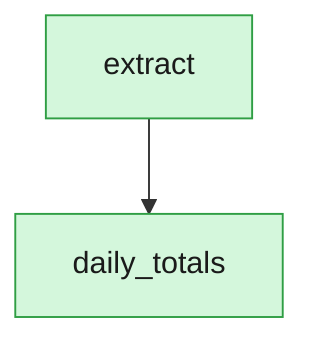

# DuckPipe

[](https://github.com/woozyking/duckpipe/actions/workflows/ci.yml)
[](https://pypi.org/project/duckpipe/)
[](https://github.com/woozyking/duckpipe/blob/main/pyproject.toml)
[](LICENSE)

**[Try it live in your browser →](https://woozyking.github.io/duckpipe/examples/08_browser_wasm/)**
No install, nothing to run — a real DuckDB pipeline, entirely in this
page, checking a file for sensitive-looking columns without ever
uploading it.

A serverless-first, DuckDB-native pipeline orchestrator. No scheduler
daemon, no central metadata database required, no broker — a run is a
Python process that starts, does work, records what it did to a
`.duckdb` file, and exits.

```python
# pipeline.py
import duckdb
from duckpipe import task, run

TAXI_DATA = "https://d37ci6vzurychx.cloudfront.net/trip-data/yellow_tripdata_2024-01.parquet"


@task
def extract():
    return duckdb.sql(f"SELECT * FROM read_parquet('{TAXI_DATA}')")


@task(cache=True)
def daily_totals(trips=extract):
    return trips.aggregate(
        "date_trunc('day', tpep_pickup_datetime) AS day, sum(fare_amount) AS total"
    ).pl()


if __name__ == "__main__":
    run(__file__)
```

```bash
uv run duckpipe run pipeline.py
```

Copy that into an empty file and it just runs: `extract` streams NYC
TLC's public trip data straight off the network via DuckDB's own
`httpfs` — no download, no local file, no fixture to go find first.
That's the whole surface area otherwise. `daily_totals(trips=extract)`
is how you declare a dependency — no `depends_on=[...]` boilerplate, no
separate DAG object, just a normal Python default argument. Run it
again and `daily_totals` reports `skipped`: nothing about its code or
`extract`'s changed, so there's nothing to redo.

(That URL is NYC TLC's current official distribution endpoint,
confirmed directly against their own [trip record data
page](https://www.nyc.gov/site/tlc/about/tlc-trip-record-data.page) —
not a permanent guarantee, though: TLC changed both the file format and
the hosting once before, from CSV on S3 to Parquet on this CloudFront
domain, back in May 2022. If this URL ever breaks, that page is where
to find the current one; see
[`examples/data/README.md`](examples/data/README.md) for more on
running against remote data at scale.)

## Why

Most teams reach for Airflow/Prefect/Dagster the moment they need "more
than one script that depends on another script," which means standing up
a scheduler, a metadata database, and usually a broker before running a
single real pipeline — fixed infrastructure tax whether your DAG moves a
thousand rows once a day or a billion rows every minute. Most pipeline
DAGs are a handful of dependent steps over data that fits on one
machine. DuckPipe is the orchestrator for *that* case: a library, not a
platform — though never at odds with a central metadata store either:
if you already run one and want several DuckPipe deployments sharing a
catalog, that's an opt-in upgrade away, not a different architecture
(see [DuckLake observability upgrade](docs/ducklake.md)). See
[`DESIGN.md`](DESIGN.md) for the full design rationale and
prior-art landscape check.

## Install

Requires Python ≥3.12; developed against 3.14.

```bash
uv add duckpipe                 # core: duckdb + typer + rich
uv add "duckpipe[remote]"       # + fsspec, for state_uri sync to any fsspec-supported store
uv add "duckpipe[s3]"           # + s3fs, for state_uri="s3://..."
uv add "duckpipe[gcs]"          # + gcsfs, for state_uri="gs://..."
uv add "duckpipe[azure]"        # + adlfs, for state_uri="az://..."
uv add "duckpipe[arrow]"        # + pyarrow, for cache_backend="arrow"
uv add "duckpipe[ducklake]"     # + pytz, for the DuckLake observability backend
uv add "duckpipe[memcap]"       # + cloudpickle, psutil, for @task(memory_limit_mb=...)
uv add duckpipe-tuning          # optional, separate package -- see below
```

Only pull in what a given trigger/backend actually needs — `s3`/`gcs`/`azure`
each already include `remote`, so e.g. a Lambda deployment package or a CI
job that only uses `state_uri="s3://..."` needs just `duckpipe[s3]`, not
every extra at once (see [`docs/triggers.md`](docs/triggers.md) for
trigger-specific install recipes).

## The whole mental model

- **`@task`** decorates a plain Python function. Any signature, any
  return type — the core never inspects what a task returns. A
  side-effect-only task (send a Slack alert, kick off a training run,
  write a log line) is exactly as first-class as one that moves data:
  just return `None`. Add `cache=True` if you want it to fire only once
  per code/upstream change instead of on every re-run — the same
  fingerprint mechanism that skips a data task skips a side effect too,
  since neither ever depended on inspecting a return value. The one
  caveat is the same one any retry-based system has: keep the side
  effect idempotent if you set `retries>0`, since a retried attempt
  could otherwise repeat part of it.
- **Dependencies are inferred from default argument values**: writing
  `def b(x=a)` where `a` is another task tells DuckPipe `b` depends on
  `a`, and at run time `x` receives `a`'s actual result. Tasks with no
  data dependency but a real ordering requirement — the common case for
  side-effect tasks — use the `@task(depends_on=[...])` escape hatch.
- **A pipeline is a Python module.** `duckpipe run pipeline.py` imports
  it once, discovers every `@task`-decorated function reachable from the
  module namespace, and runs the resulting DAG. Splitting tasks across
  sibling files needs no DuckPipe-specific mechanism — normal Python
  imports (including relative ones, `from .extract import extract`)
  between files in the same package work exactly as they would anywhere
  else; `pipeline.py` just needs to end up importing (directly or
  transitively) every task you want included.
- **State is a `.duckdb` file** next to the pipeline (path configurable).
  `SELECT * FROM task_runs` in any DuckDB client tells you what happened
  — no separate UI.
- **Caching is `@task(cache=True)`.** DuckPipe fingerprints a task's
  source + config + upstream fingerprints (never its output data) and,
  on a cache hit, skips the task and hands the cached value downstream.
  `--force` re-runs everything regardless. Default cache storage is
  pickle; `cache_backend="arrow"` (needs `duckpipe[arrow]`) is a leaner
  alternative for tabular results — a DuckDB relation, pandas/Polars
  DataFrame, or pyarrow Table.
- **Resuming from a failure needs no special flag.** A failed task never
  gets a fingerprint or cached value, so re-running the exact same
  command only re-executes what failed (and anything downstream of it)
  — everything else with `cache=True` and unchanged code just skips, the
  same as any other unchanged re-run.
- **Retries are `@task(retries=N, retry_delay=seconds)`.**
- **A per-task physical memory ceiling is `@task(memory_limit_mb=N)`.**
  Runs that one task in an isolated subprocess under an RSS watchdog;
  crossing the limit kills it and records `status="oom"` — a real
  result in the state file, not a crash or a silent OS OOM-kill. Needs
  the optional `duckpipe[memcap]` extra. Opt-in, and it generalizes a
  pattern proven in production dogfooding rather than invented from
  scratch — see [`DESIGN.md`](DESIGN.md) §5.
- **Triggers are just "run the command."** Cron, CI, a webhook handler, a
  Lambda entrypoint, or a single step embedded inside Airflow/Prefect/
  Dagster all just call `duckpipe.run(...)` — DuckPipe has no scheduler
  daemon of its own.

No work pools, no deployments-as-a-separate-entity, no task-runner menu.
Full rationale for each of these choices — including the open questions
still being resolved — is in [`DESIGN.md`](DESIGN.md) §5, §12.

## CLI

```bash
duckpipe run pipeline.py [--db PATH] [--state-uri URI] [--force] [--max-workers N] [--only TASK]
duckpipe show pipeline.py [--db PATH] [--json] [--mermaid]  # resolved DAG, last-run status, next-run preview, or a flowchart
duckpipe stats duckpipe.db [--limit N] [--snapshots] # recent runs + per-task timing, or DuckLake time travel
duckpipe compact state_uri                          # fold distributed workers' pending state into one file
```

`--db` accepts a plain path or a `ducklake:...` catalog string — see
[DuckLake observability upgrade](docs/ducklake.md).

A malformed pipeline (a dependency cycle, two tasks sharing a name) is
reported as one short line, not a framework traceback. `duckpipe show`
in particular doubles as a dry run: its "next run" column tells you
which tasks would skip vs. re-run before you spend the time actually
running it. `duckpipe show pipeline.py --mermaid` prints a
[Mermaid](https://mermaid.js.org) flowchart of the same DAG instead —
colored by each task's last recorded status when state exists — paste
it straight into a PR description, a wiki page, or anywhere else that
renders Mermaid:



`duckpipe.to_mermaid()`/`duckpipe.to_json()` are the same rendering,
importable directly — a notebook or a custom dashboard doesn't need to
shell out to the CLI just to get the string. `to_mermaid` also takes an
optional `subgraphs=` argument: if one of your tasks' own body runs
another pipeline (nesting `duckpipe.run(...)` inside a task is safe —
see [`DESIGN.md`](DESIGN.md) §11), pass that sub-pipeline's own
topological order to render it as a real nested subgraph instead of a
plain node — DuckPipe can't discover that relationship on its own, so
this is how you state it.

The state file's own views (`v_latest_task_status`, `v_run_summary`,
`v_task_stats`) are plain SQL and queryable from any DuckDB client, not
just through the CLI:

```sql
duckdb duckpipe.db -c "SELECT * FROM v_run_summary ORDER BY started_at DESC LIMIT 5"
```

## Examples

Nine realistic pipelines over real, bundled open data (NYC TLC taxi
trips) live in [`examples/`](examples/README.md) — one per facet of
DuckPipe, from a plain batch ETL through distributed execution,
DuckLake, a serverless executor, nested pipelines, and running in the
browser. Every non-distributed one also runs unmodified against the full public
dataset by setting one environment variable; see
[`examples/data/README.md`](examples/data/README.md).

## Scaling out

Four upgrades, each opt-in and each usable on its own — full detail in
[`docs/`](docs/):

- **[Distributed execution](docs/distributed_execution.md)** — sync
  state to remote storage (`state_uri`), then scope a run to one task
  (`only=`/`--only`) so many workers can safely share a DAG at once,
  with no lock contention.
- **[DuckLake observability](docs/ducklake.md)** — point `db_path` at a
  DuckLake catalog instead of a plain file for real snapshot history,
  time travel, and schema evolution with no migration step. Same
  argument, same commands.
- **[Serverless executor](docs/serverless_executor.md)** — the
  distributed-execution primitive above, checked against two genuinely
  different invocation shapes (a container, a FaaS `handler`) to prove
  it isn't tied to one platform.
- **[Beefy-node mode](docs/remote_execution.md)** and
  **[running in the browser](docs/browser.md)** — the same code
  unchanged on a bigger machine, or inside a browser tab via Pyodide.

## Tuning (optional, separate package)

`duckpipe-tuning` suggests engine settings from host specs (CPU count,
RAM) — pure functions, no query execution, no data inspection, no
engine connection ever touched. One module per engine (DuckDB, Polars,
Dask, Daft). It's a genuinely separate package in this repo's uv
workspace (`packages/duckpipe-tuning/`), not a submodule: `duckpipe`
itself never imports `psutil` or knows this package exists.

```python
import duckdb
from duckpipe_tuning.duckdb import suggest_duckdb_settings

con = duckdb.connect()
settings = suggest_duckdb_settings(workload="join")
con.execute(f"SET threads = {settings['threads']}")
con.execute(f"SET memory_limit = '{settings['memory_limit']}'")
```

See [`packages/duckpipe-tuning/README.md`](packages/duckpipe-tuning/README.md)
for Polars/Dask/Daft.

## Docs

[`docs/`](docs/) has the full chapter list — triggers, interop,
agent-authored pipelines, distributed execution, DuckLake, the
serverless executor, beefy-node mode, and the browser — each short and
linking back to the example code it describes. [`DESIGN.md`](DESIGN.md)
is the design rationale and prior-art landscape check behind all of it.

## Development

This repo is a uv workspace: `duckpipe` at the root, `duckpipe-tuning`
under `packages/`.

```bash
uv sync --group dev
uv run pytest                                        # duckpipe
uv run --directory packages/duckpipe-tuning pytest   # duckpipe-tuning
uv run ruff check .
uv run python scripts/phase0_bench_fanout.py          # DAG-level concurrency benchmark
```

CI (`.github/workflows/ci.yml`) runs all of the above on every push and
PR — also a live example of the GitHub Actions trigger recipe above.

## Status

Pre-1.0. Everything documented above is implemented and covered by the
test suite: the core scheduler/fingerprinting/CLI, optional `fsspec`
remote state sync with an advisory lock, task-scoped distributed
execution (`only=`/`--only`) with delta-merge state, the DuckLake
observability upgrade (local SQLite catalog or a shared Postgres/MySQL
one), the serverless-executor and beefy-node patterns, browser execution
via Pyodide, the Mermaid DAG export, and the opt-in per-task memory
ceiling (`memory_limit_mb`).

**Not yet built:**
- Remote sync (`state_uri`) and the DuckLake backend don't work inside
  the browser example — needs `fsspec`-in-Pyodide verified first
  (DESIGN.md §8, §12).
- A versioning/compatibility promise are still open decisions (DESIGN.md §12).
