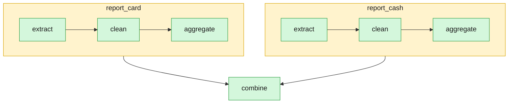

# 09 — nesting a pipeline inside a task, and making that nesting visible

`report_card` and `report_cash` don't just crunch data themselves: each
calls `duckpipe.run()` on [`report_pipeline.py`](report_pipeline.py) — a
genuinely separate, independently-runnable pipeline (`extract → clean →
aggregate`, daily trip count and revenue) — once per payment type, each
with its own state file. Nesting `duckpipe.run()` inside a task is safe
(`DESIGN.md` §11): a task's own body always runs in a thread-pool
worker, never on the scheduler's own event loop, so the inner run's own
`asyncio.run()` never collides with the outer one.

```
    report_card ─┐
                  ├─► combine
    report_cash ─┘
```

Each of `report_card`/`report_cash` is itself a full 3-task pipeline —
`duckpipe show pipeline.py --mermaid` alone can't show that (DuckPipe
has no way to discover that a task's body happens to run another
pipeline; that would mean statically analyzing arbitrary Python).
[`show_nested_mermaid.py`](show_nested_mermaid.py) states it explicitly
instead, using `to_mermaid`'s `subgraphs=` parameter — the exact
sub-pipeline each task's own body calls:

```bash
uv run duckpipe run examples/09_nested_pipeline/pipeline.py   # run it once first
uv run python examples/09_nested_pipeline/show_nested_mermaid.py
```

The real, rendered result after two runs (the second one, everything
unchanged, correctly shows both nested calls as `skipped` — but their
*inner* tasks still show their own real history, from each nested run's
own separate state file, not the outer one):



`report_pipeline.py` stays independently runnable and testable too, the
same as any other DuckPipe pipeline — with its own explicit `--db` (the
same convention every other example uses, and for the same reason: the
CLI's own default state-file name would otherwise collide with
`pipeline.py`'s own, right next to it):

```bash
uv run duckpipe run examples/09_nested_pipeline/report_pipeline.py \
    --db examples/09_nested_pipeline/report.duckdb
```

## Two things this example found the hard way, not by assuming

- **`report_pipeline.py` uses its own explicit `duckdb.connect()`**,
  not the bare `duckdb.sql()` default connection
  [`01_daily_batch_etl`](../01_daily_batch_etl/duck.py) uses. That
  default is one connection shared by the whole *process* — and a
  standalone pipeline script reloads fresh on every `duckpipe.run()`
  call, including a nested one, but isn't guaranteed to run in the same
  worker thread each time. The first version of this example used the
  shared default and failed with `Invalid Input Error: Attempting to
  execute an unsuccessful or closed pending query result` — a real bug,
  caught by actually running it, not by reasoning about it in advance.
  This is the actual fix.
- **`max_workers=1` on the outer run, by contrast, turned out *not* to
  be required once the connection fix was in** — confirmed with 5
  clean back-to-back runs of the true, unbounded-concurrency version.
  `report_pipeline.py`'s connection is fresh on every reload, so the
  two nested calls never share one to race on regardless of whether
  they overlap in time. Kept anyway as a cheap default (`DESIGN.md` §12,
  "Concurrency default") — stated honestly here as belt-and-suspenders,
  not oversold as the fix it isn't.
