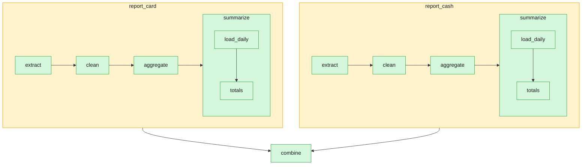

# 09 — nesting a pipeline inside a task, to any depth, and making that nesting visible

`report_card` and `report_cash` don't just crunch data themselves: each
calls `duckpipe.run()` on [`report_pipeline.py`](report_pipeline.py) — a
genuinely separate, independently-runnable pipeline (`extract → clean →
aggregate → summarize`, daily trip count/revenue plus an overall
summary) — once per payment type, each with its own state file.
`report_pipeline.py` doesn't stop there either: its own last task,
`summarize`, nests a *third* pipeline,
[`summary_pipeline.py`](summary_pipeline.py). Three real levels, not a
toy two. Nesting `duckpipe.run()` inside a task is safe at any depth
(`DESIGN.md` §11): a task's own body always runs in a thread-pool
worker, never on the scheduler's own event loop, so an inner run's own
`asyncio.run()` never collides with an outer one, no matter how many
levels deep.

```
    report_card ─┐
                  ├─► combine
    report_cash ─┘
```

Each of `report_card`/`report_cash` is itself a full 4-task pipeline,
and that pipeline's own last task is itself a full 2-task pipeline —
`duckpipe show pipeline.py --mermaid` alone can't show any of that
(DuckPipe has no way to discover that a task's body happens to run
another pipeline, let alone that *that* pipeline nests a third; that
would mean statically analyzing arbitrary Python).
[`show_nested_mermaid.py`](show_nested_mermaid.py) states all three
levels explicitly instead, using `to_mermaid`'s `subgraphs=` parameter
— now recursive, so the third level is the same argument shape as the
first, just one level deeper:

```bash
uv run duckpipe run examples/09_nested_pipeline/pipeline.py --max-workers 1   # run it twice
uv run duckpipe run examples/09_nested_pipeline/pipeline.py --max-workers 1   # to see it skip
uv run python examples/09_nested_pipeline/show_nested_mermaid.py
```

The real, rendered result after those two runs (the second one,
everything unchanged, correctly shows both outer nested calls as
`skipped` — but every inner task, all the way down, still shows its own
real history, from its own separate state file, not an outer one):



`report_pipeline.py` and `summary_pipeline.py` both stay independently
runnable and testable too, the same as any other DuckPipe pipeline —
each with its own explicit `--db` (the same convention every other
example uses, and for the same reason: the CLI's own default
state-file name would otherwise collide with the file nesting it,
right next to it):

```bash
uv run duckpipe run examples/09_nested_pipeline/report_pipeline.py \
    --db examples/09_nested_pipeline/report.duckdb
uv run duckpipe run examples/09_nested_pipeline/summary_pipeline.py \
    --db examples/09_nested_pipeline/summary.duckdb
```

## Three things this example found the hard way, not by assuming

- **`report_pipeline.py` uses its own explicit `duckdb.connect()`**,
  not the bare `duckdb.sql()` default connection
  [`01_daily_batch_etl`](../01_daily_batch_etl/duck.py) uses. That
  default is one connection shared by the whole *process* — and a
  standalone pipeline script reloads fresh on every `duckpipe.run()`
  call, including a nested one, but isn't guaranteed to run in the same
  worker thread each time. The first version of this example used the
  shared default and failed with `Invalid Input Error: Attempting to
  execute an unsuccessful or closed pending query result` — a real bug,
  caught by actually running it, not by reasoning about it in advance.
  This is the actual fix.
- **`max_workers=1` on the outer run turned out to matter for a
  different reason than first assumed, and adding a third nesting level
  is what surfaced it.** With only `report_card`/`report_cash` nesting
  `report_pipeline.py`, 5 clean back-to-back unbounded-concurrency runs
  suggested `max_workers=1` was just a cheap default, not load-bearing
  (an earlier version of this note said exactly that). Adding
  `summarize` — which hands its payment type to its own nested call via
  the process-wide `DUCKPIPE_EXAMPLE_PAYMENT_TYPE` environment variable
  — changed that: `report_card` and `report_cash` running at once now
  reliably race on that shared variable, one nested call reading the
  *other's* value mid-flight, and fail outright with a state-file
  write-write conflict. `max_workers=1` is what serializes them so that
  race can't happen. Confirmed the hard way (again): removing the flag
  reliably reproduces the failure. DESIGN.md §12 ("Concurrency default")
  already documents this exact category of footgun — tasks sharing a
  resource need this stated explicitly, since DuckPipe can't infer
  "these shouldn't overlap" from the DAG shape alone. The lesson isn't
  "trust the flag less" — it's that a claim like "this default isn't
  load-bearing" is only as good as what's actually been nested inside;
  a small, honest reminder to keep re-verifying rather than assuming a
  past result still holds after the pipeline itself grows a level.
- **`to_mermaid`'s `subgraphs=` needed to actually recurse, and didn't
  at first.** The original implementation hardcoded an empty
  `subgraphs` dict for whatever it rendered inside a subgraph, so a
  nested pipeline's own nested pipeline silently flattened into a plain
  node instead of its own `subgraph` block. Fixed by recursing with
  that inner pipeline's own `subgraphs` argument instead of `{}` — the
  third, optional element of the tuple each entry in `subgraphs` maps
  to. No new concept: the same argument shape, one level deeper, for as
  many levels as a pipeline actually nests.
