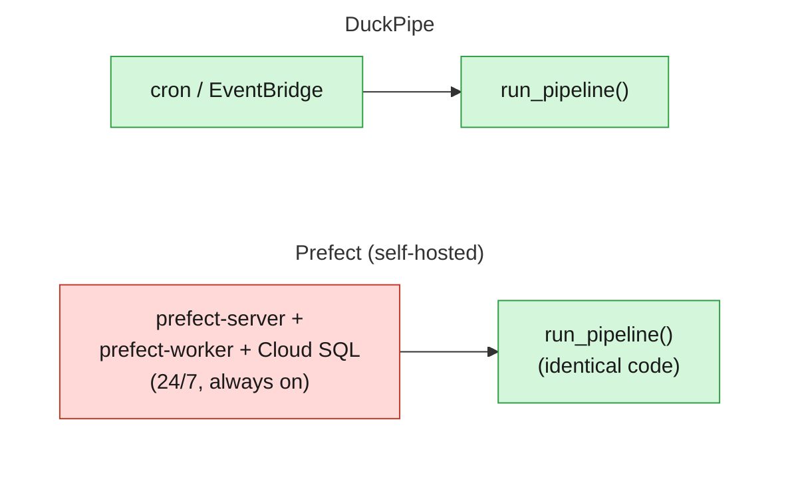

# 11 — quantifying "no standing infrastructure" in real energy and dollar terms

DuckPipe's own pitch is "serverless-first" — no scheduler, no
webserver, no metadata database sitting there 24/7 waiting for a cron
tick. That claim is easy to state and hard to size. This example sizes
it, in kWh/year and $/year, using real energy-per-vCPU figures and
Prefect's own published pricing instead of a vibe.

The comparison is built to isolate exactly one variable:



`run_pipeline()` (green, both arms) is bit-for-bit identical — same
code, same data, same duration, same memory. The red box is the only
thing that differs between them: something has to be resident 24/7,
before the Prefect arm's call can even happen. Nothing here argues
DuckDB is faster than some other engine; the engine is held constant on
purpose, so the entire measured delta is the standing orchestrator
itself, not an engine-speed claim riding along with it. (Prefect is the
one used here because it's the one this project's own blog post has
real, first-hand complexity scars from, and a real setup to inspect —
Airflow or Dagster would show the same shape, self-hosted or managed,
for the same reason: something has to sit there waiting for a schedule
to fire.)

The diagram shows the *self-hosted* case specifically, because that's
the one with an actual box: something you provision and run yourself,
24/7. Prefect Cloud's own managed case, done right, has no box of its
own at all — see below.

## The pipeline

An actual DuckPipe pipeline, its real generated diagram
(`duckpipe show --mermaid`), not a stand-in:


Borough-level daily trip counts and revenue over a full year of real
NYC TLC yellow-taxi trips (12 monthly parquet files straight off
CloudFront, ~35M rows), joined against the real zone lookup table —
the same fact/dimension join shape as datapunk's own suite_03, chosen
so this is a believable stand-in for "the kind of job a team reaches
for a cluster over," not a toy. Falls back to the bundled ~12k-row
sample for a quick correctness check; see `pipeline.py`'s own
docstring.

`run_pipeline.py` wraps the whole pipeline in one plain function call —
deliberately not shaped like any one platform's own calling convention.
(Contrast [`examples/07_serverless_executor`](../07_serverless_executor/),
whose own `handler(event, context)` *is* AWS Lambda's specific shape, on
purpose, to prove DuckPipe isn't locked to one invocation style.) It
runs start to finish in a single invocation, the realistic shape for a
modest daily batch job.

## Two real setups, both minimal for what they are

Both assume the pipeline itself runs the same way DuckPipe's own arm
does: on-demand, serverless, whichever platform (see Prefect's own docs
for how work pools actually route a flow run to infrastructure —
https://docs.prefect.io/v3/concepts/work-pools — that's not repeated
here).

**Self-hosted** needs a worker resident 24/7 — confirmed against a real
setup, not assumed. `kubectl get pods -n prefect` on this project's own
Prefect-on-GKE cluster turns up one `prefect-server` pod and one
`prefect-worker` pod, both resident for days, while actual flow runs
show up as separate, short-lived pods elsewhere. **Prefect Cloud**
skips the worker instead, submitting flow runs straight to your own
serverless infrastructure — the subscription itself is still a real,
unavoidable cost. Two real numbers below, not one picked to make either
side look worse.

Why more than one of either ever exists: self-hosted Prefect Server has
no native multi-tenant workspace isolation, and Prefect's own
documentation for that gap recommends running one Server instance per
team (https://www.prefect.io/prefect/customer-managed) — the same
pattern Astronomer (an Airflow vendor) documents as "Airflow sprawl" in
that ecosystem, for the same reason: noisy-neighbor risk and no
fine-grained access control in a shared instance. Prefect Cloud's own
*workspaces* are built to answer exactly that gap without needing N
separate installs — which is why the scaling below compares the same
hypothetical org (50 teams) both ways, not an arbitrary multiplier on
one side only.

## Run it

```bash
# bundled sample -- quick correctness check, not the headline numbers
uv run python examples/11_sustainability/measure_and_quantify.py

# the real, full-year run this README reports
DUCKPIPE_EXAMPLE_DATA="$(python3 -c "print(','.join(
    f'https://d37ci6vzurychx.cloudfront.net/trip-data/yellow_tripdata_2024-{m:02d}.parquet'
    for m in range(1, 13)))")" \
  uv run python examples/11_sustainability/measure_and_quantify.py
```

`measure_and_quantify.py` runs `run_pipeline()` in its own subprocess
(never the measuring one), polls its real peak RSS the same way
datapunk's own `runner.py` watches an engine subprocess, rounds that up
to a real Lambda memory tier, and quantifies annual energy from there.
See `data/README.md` for the general full-dataset URL pattern this
extends.

## Real observed result (12 months, ~35M rows, real NYC TLC data)

```
sources: 12 -- running run_pipeline()...

measured: 1.23s wall clock, peak RSS 169.8 MB
rounded up to a real Lambda tier: 256 MB

-- hyperscale (PUE 1.09) --
  one run_pipeline() invocation: 0.000 Wh
  365 runs/year (both arms, identical): 0.00 kWh/year
  self-hosted standing infra, 24/7: 25.25 kWh/year
  => eliminating standing infra saves ~25.2 kWh/year per setup (659450x the actual job's own footprint)
     at    10 such setups: ~252 kWh/year
     at   100 such setups: ~2,525 kWh/year
     at  1000 such setups: ~25,250 kWh/year

-- industry avg (PUE 1.54) --
  one run_pipeline() invocation: 0.000 Wh
  365 runs/year (both arms, identical): 0.00 kWh/year
  self-hosted standing infra, 24/7: 35.67 kWh/year
  => eliminating standing infra saves ~35.7 kWh/year per setup (659450x the actual job's own footprint)
     at    10 such setups: ~357 kWh/year
     at   100 such setups: ~3,567 kWh/year
     at  1000 such setups: ~35,674 kWh/year

-- dollars: 365 run_pipeline() invocations/year (both arms, identical): $0.00/year --

self-hosted (our own real GKE setup, inspected not estimated):
  prefect-server + prefect-worker + Cloud SQL, 24/7: $2,761/year
  no native multi-tenant workspace isolation -- one instance per team is
  Prefect's own community-recommended workaround, not an arbitrary multiplier:
     at    10 teams, each with their own instance: ~$27,606/year
     at    50 teams, each with their own instance: ~$138,029/year
     at  1000 teams, each with their own instance: ~$2,760,576/year

Prefect Cloud (managed, push work pool): the same 50 teams, one
  shared workspace instead, at $1,200/year per seat --
  Cloud's own answer to that isolation gap:
      50 seats (1/team): $60,000/year total
     100 seats (2/team): $120,000/year total
```

The job's own footprint scales with the data (8.90s / 1024MB on an
earlier, slower-network run vs. 1.23s / 256MB here vs. 0.94s / 256MB
against the bundled sample) — the standing-infra number does not,
because it is paid whether or not a job is running at all. That is the
entire point: the eliminated cost is a function of *time*, not of how
demanding any given run is.

Not a "which is cheaper" claim — Prefect Cloud's own seats-per-team
ratio varies by org, so pinning the two numbers against each other would
overstate a precision neither side actually has. Both are real, sourced
figures for the same 50-team org; which one applies depends on how that
org actually chooses to run Prefect. See the honest caveats below for
what this comparison does and doesn't claim.

## Where every number comes from

- **CPU energy coefficients** (`CPU_KW_MIN` / `CPU_KW_MAX`): Cloud
  Carbon Footprint's own "Cloud Jewels" methodology (originally Etsy's),
  AMD EPYC 3rd-gen figures derived from real SPECpower_ssj2008 committee
  data — kW per vCPU at ~0% and at 100% utilization.
  https://www.cloudcarbonfootprint.org/docs/methodology/
- **Standing self-hosted footprint** (`SELF_HOSTED_STANDING_VCPU=4`): not
  an estimate — the exact vCPU count of the GKE node running
  `prefect-server` + `prefect-worker` in a real setup, read directly via
  `kubectl get node -o jsonpath='{.metadata.labels}'`
  (`t2d-standard-4`). `SELF_HOSTED_AVG_UTILIZATION=0.15` is still an
  assumption (`kubectl top` isn't a substitute for a real utilization
  history) — deliberately conservative; a busier server only makes the
  eliminated cost larger, not smaller.
- **PUE** (data center overhead): two real, current (2025) figures used
  as a range rather than the flattering one alone — Google's own
  fleet-wide average (1.09) and the Uptime Institute's global survey
  average (1.54).
- **Lambda memory-to-vCPU** (`LAMBDA_MB_PER_VCPU=1769`): AWS's own
  documented relationship — at 1,769 MB a function gets one full vCPU
  equivalent, scaling linearly below that. Used here purely as a
  representative billing model for lean serverless compute generally
  (Cloud Functions, Cloud Run, and Azure Functions all bill similarly)
  — `run_pipeline()` itself isn't bound to Lambda's calling convention.
  https://docs.aws.amazon.com/lambda/latest/dg/configuration-memory.html
- **365 runs/year**: a daily batch cadence, matching `run_pipeline.py`'s
  own "modest daily batch job" framing.
- **Lambda list pricing** (`LAMBDA_PRICE_PER_GB_SECOND_USD`,
  `LAMBDA_PRICE_PER_REQUEST_USD`): AWS's own published on-demand rates,
  x86, us-east-1, no savings plan applied.
  https://aws.amazon.com/lambda/pricing/
- **Self-hosted dollar cost**, the real setup again, not an estimate:
  `GCP_NODE_HOURLY_USD=0.169` is `t2d-standard-4`'s own on-demand rate,
  us-central1 (https://cloudprice.net/gcp/compute/instances/t2d-standard-4);
  `CLOUDSQL_VCPUS=2`/`CLOUDSQL_MEMORY_GB=8`/`CLOUDSQL_STORAGE_GB=25` are
  that setup's exact Cloud SQL shape, read via `gcloud sql instances
  describe ... --format='value(settings.tier,settings.dataDiskSizeGb)'`
  (`db-custom-2-8192`); `CLOUDSQL_VCPU_HOURLY_USD=0.0413`,
  `CLOUDSQL_GB_HOURLY_USD=0.007`, and
  `CLOUDSQL_STORAGE_GB_MONTHLY_USD=0.22` are Cloud SQL's own published
  per-resource, zonal (non-HA), on-demand rates
  (https://cloud.google.com/sql/docs/postgres/pricing).
- **Prefect Cloud dollar cost** (`PREFECT_STARTER_MONTHLY_USD=100`,
  `PREFECT_TEAM_PER_SEAT_MONTHLY_USD=100`): Prefect's own published Cloud
  pricing, checked directly against https://www.prefect.io/pricing —
  Starter is a flat rate for up to 3 seats; Team bills per seat past a
  4-seat minimum. No worker cost is added here: with a *push* work pool
  (AWS ECS/Fargate, Google Cloud Run, or Azure Container Instances —
  Prefect Cloud submits directly using your cloud credentials), no
  worker of your own runs at all
  (https://docs.prefect.io/v3/how-to-guides/deployment_infra/serverless).
- **Team-scale comparison** (`TEAMS_EXAMPLE=50`, `SEATS_PER_TEAM_LOW=1`,
  `SEATS_PER_TEAM_HIGH=2`): 50 teams is this example's own illustrative
  org size, not a survey result; 1-2 seats per team is a realistic
  range for how many people per team actually need direct platform
  access, not a per-headcount assumption. Chosen to give the self-hosted
  and Prefect Cloud numbers a shared unit (the same 50 teams) instead of
  two unrelated scales.

## Honest caveats

- The ~659,000x multiplier is real given these assumptions, but it says
  "removing a 24/7 idle service is nearly free once nothing needs it
  standing," not "DuckDB uses 659,000x less energy than some other
  engine." `run_pipeline()` is the same function, same code path, same
  duration, in both arms — nothing about engine performance enters the
  comparison, because it's held constant on purpose.
- The self-hosted figures come from one real setup, not a fleet survey.
  `SELF_HOSTED_AVG_UTILIZATION=0.15` is still an assumption (a real
  utilization history wasn't pulled, only the node's own vCPU count) —
  deliberately conservative, so a busier server only makes the
  eliminated number larger, not smaller. A leaner or heavier real setup
  shifts it accordingly; this is one honest data point, not a universal
  Prefect number.
- Self-hosted and Prefect Cloud aren't directly interchangeable, and the
  two dollar figures shouldn't be summed, averaged, or ranked against
  each other: self-hosted is priced *per instance* (one per team, the
  community's own recommended isolation workaround); Prefect Cloud is
  priced *per seat*, on one shared workspace with native per-team
  isolation built in. Which one actually costs less for a real org
  depends on its own real seats-per-team ratio, something this example
  doesn't know and isn't claiming to — the $60K-$120K/year range already
  reflects that uncertainty rather than picking one number to compare
  against the self-hosted figure.
- `TEAMS_EXAMPLE=50` and the 1-2 seats/team range are this example's own
  illustrative numbers, not a survey result — chosen so both arms of the
  comparison share one real-world reason to scale at all (no native
  multi-tenant isolation in self-hosted Prefect Server), not an
  arbitrary round number picked to make the eliminated total look
  large. A different real org would plug in its own team count and
  seats-per-team; the shape of the comparison (per-instance vs.
  per-seat) doesn't change.
- The measured wall-clock time reflects this run's own network
  conditions against NYC TLC's CDN on the day it ran — separate runs of
  this same script, same 12-month dataset, have seen 1.22s, 1.26s,
  1.27s, 1.38s, 2.09s, and 8.90s, and the multiplier has moved anywhere
  from ~28,000x to ~828,000x accordingly. A longer or heavier job run
  raises the job's own footprint, which *shrinks* the multiplier, not
  the other way around. What doesn't move is the absolute standing cost
  (~$2,761/year self-hosted per instance, ~$60,000-$120,000/year Prefect
  Cloud for the same 50 teams, ~25.2-35.7 kWh/year self-hosted): those
  numbers are a function of time the infra stands there, not of how
  demanding any single run is — which is exactly the point this
  comparison is trying to isolate.
- This doesn't model an actual orchestrator setup's own job-execution
  cost or the observability add-ons (Grafana, Loki, Promtail) running
  alongside the real setup inspected here — only the standing baseline
  Prefect's own Helm chart needs to function at all, which is the
  specific piece a serverless-first design eliminates. A team running
  its own logging/metrics stack on top pays more than this floor, on
  either side of the comparison.
